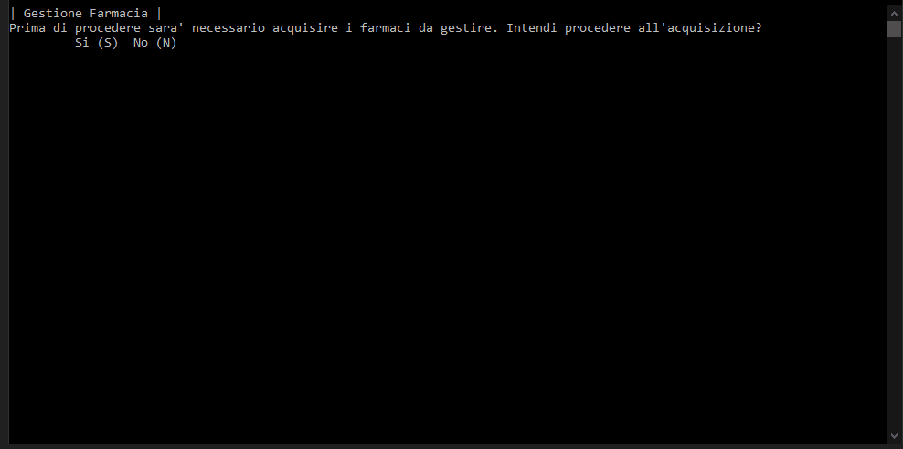

# UNIBA_PROG_PharmaceuticalCompany
The program allows you to upload information relating to drugs and manage their inventory.

A pharmaceutical company produces several drugs. For each, the alphanumeric code (eg EP1232), the name (eg Nimesulide), the number of packages available, the expiry date expressed in the month and year format (eg 12 2018) are known. 
Design a program that allows you to:
 - load drug information into a table;
 - view how many packages are available in stock;
 - view how many packages, in total, expire after a date entered by the user in input; 
 - view how many packs are available for a drug whose code is entered in input by the user;
 - view the name and code of the drug for which multiple packs are available; 
 - provide the list of drugs sorted by number of packs (use the bubblesort algorithm). 

Manage the case of multiple drugs that correspond with the maximum through the following simplified approach: calculate the maximum and, subsequently, print all drugs that have that number of packs.
